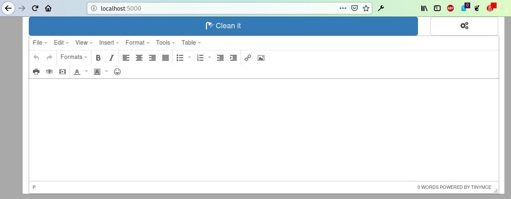

# HTML cleaner
Web app for html cleaning built with _Flask_ framework.


Set up environment
```bash
which python3 #Output: /usr/bin/python3
mkvirtualenv --python=/usr/bin/python3 hclean-web
pip install -r requirements.txt
```

Run the app, then point your browser to <http://localhost:5000>
```bash
gunicorn --workers 1 --bind 0.0.0.0:5000 wsgi
```

